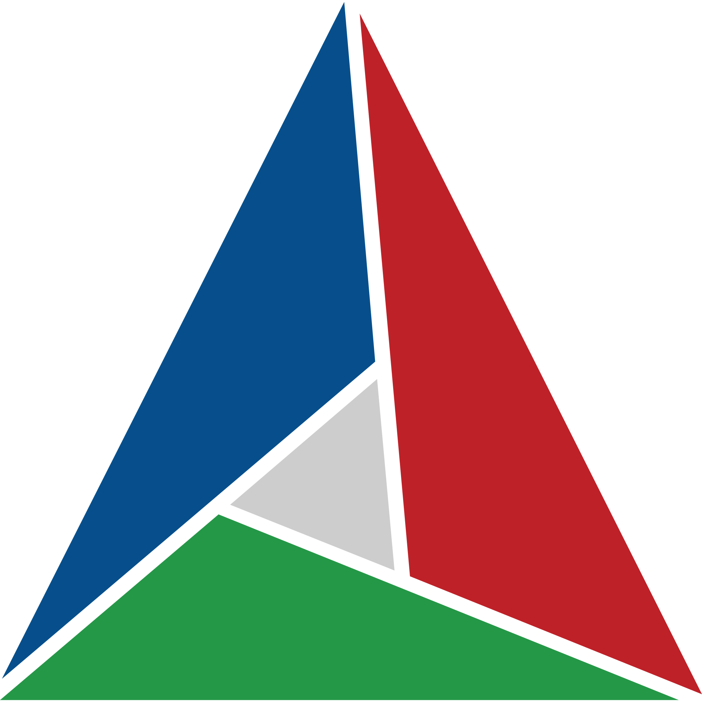

# About Me

⚡&ensp;Graphics and game engine programmer

&ensp;@igloo4life

## Languages & Tools

 
     
    &ensp;
     
    &ensp;
     
     
     
     
     
    &ensp;
     
    &ensp;
     
    &ensp;
     

